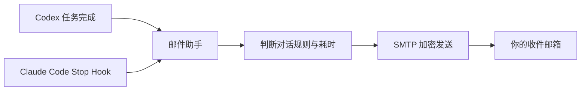

# Codex / Claude Code 邮件助手

让长时间运行的 Codex 和 Claude Code 任务在完成后主动发邮件通知你。

这是一个面向 Windows 的公开源码桌面工具。它把 Codex 的任务完成通知和 Claude Code 的 `Stop Hook` 接入 SMTP 邮箱；当任务达到设定时长，或符合你为对话设置的发送规则时，软件会生成一封简洁的 HTML 邮件，告诉你哪个项目、哪项任务已经完成，以及最终实现了什么。

> 当前版本：v1.6.0。项目为社区工具，与 OpenAI、Anthropic、腾讯或网易没有隶属关系。

## 它解决什么问题

运行代码生成、批量改写、测试修复或文档整理时，任务可能需要几分钟甚至更久。你不必一直盯着 Codex 或终端窗口：任务完成后，邮件助手会把结果送到你的邮箱。



## 主要功能

- 同时支持 Codex 桌面版和终端中的 Claude Code。
- Codex 可按整个对话设置“始终发送、始终不发、按耗时判断”。
- Claude Code 使用独立的全局发送规则，无需维护工作目录列表。
- Codex 与 Claude Code 拥有两套互不影响的自动发送时间阈值。
- 自动识别项目与非项目对话，并在邮件中显示项目名称和工作目录。
- 邮件包含最后一条有效要求、完成结果、回答耗时、本次任务 Token 用量、发送原因和任务 ID。
- 自动识别 QQ、Foxmail、163、126、Gmail、Outlook 等常用 SMTP 参数。
- 提供邮箱授权码官方页面入口，但不会读取网页、剪贴板或自动获取授权码。
- 授权码通过 Windows DPAPI 加密，仅当前 Windows 用户可以解密。
- 支持中文路径和 UTF-8 内容，并过滤 Claude Code 的终端回显。
- 后台 Hook 异步发送邮件，软件无需一直保持打开。
- 提供一键安装、自定义安装路径、桌面快捷方式和标准卸载入口。

## 下载与安装

普通用户请前往 [Releases](../../releases/latest) 下载最新版安装程序：

```text
CodexClaudeMailAssistant-Setup-1.6.0.exe
```

安装程序提供两种方式：

1. 一键安装：使用推荐目录并创建桌面快捷方式。
2. 自定义安装：自行选择安装路径和快捷方式选项。

升级时建议先退出已经打开的 Codex 和 Claude Code 终端，安装完成后重新打开一次。

## 快速配置

1. 启动“Codex 与 Claude Code 邮件助手”。
2. 填写发送邮箱和收件邮箱。
3. 点击“自动识别 SMTP”。
4. 填写邮箱提供商生成的授权码或应用专用密码。
5. 分别设置 Codex、Claude Code 的自动发送阈值。
6. 在顶部选择平台，点击“保存并连接 Codex”或“保存并连接 Claude Code”。
7. 重启对应的 Codex 应用或 Claude Code 终端。

> 请勿填写邮箱登录密码。QQ、163 等邮箱通常要求先开启 SMTP 服务并生成授权码；Gmail、Outlook 通常需要应用专用密码。

## 发送规则

### Codex

软件按照 Codex 侧栏中的对话标题展示任务，同一对话不会被拆分成多次聊天。每个对话可以选择：

- 始终发送
- 始终不发
- 按 Codex 耗时阈值自动判断

为了兼容旧的使用方式，Codex 仍支持以下提示词：

| 控制词 | 效果 |
|---|---|
| `#邮件开启` | 打开当前对话的持续邮件通知 |
| `#邮件关闭` | 关闭当前对话的持续邮件通知 |
| `#邮件自动` | 恢复按耗时自动判断 |
| `#本次邮件` | 仅当前任务发送一次 |

### Claude Code

Claude Code 在用户级 `~/.claude/settings.json` 中使用异步 `Stop Hook`。每个终端会话都会提供自己的会话 ID、记录文件和工作目录，因此可以同时运行多个 CC 窗口，也不需要手动录入项目路径。

Claude Code 可选择：

- 始终发送
- 始终不发
- 按 Claude Code 独立耗时阈值自动判断

## 邮件内容

邮件会使用以下主题格式：

```text
[Codex任务完成][项目对话] 这是一封 Codex 任务完成通知邮件。
[Claude Code任务完成][非项目对话] 这是一封 Claude Code 任务完成通知邮件。
```

正文包含：

- 任务类型与项目名称
- 最后一条有效用户要求
- Codex 或 Claude Code 的完成结果
- 回答耗时、本次任务 Token 用量、发送原因和完成时间
- 工作目录、任务 ID 和回合 ID

## 隐私与安全

- 软件不会把授权码写入源码或普通 JSON 配置。
- 授权码保存在 `%APPDATA%\CodexEmailNotifier\smtp_password.dpapi`，并由 Windows DPAPI 加密。
- 普通配置保存在 `%APPDATA%\CodexEmailNotifier\config.json`。
- 软件不会自动读取授权码网页或剪贴板。
- 邮件通过你自己配置的 SMTP 服务器直接发送，不经过本项目的中转服务器。
- 提交问题时请隐藏邮箱地址、授权码、API Token、个人路径和邮件正文中的敏感信息。

## 从源码运行

环境要求：Windows 10/11、Python 3.11 或更高版本。

```powershell
python .\codex_email_app.py
```

运行测试：

```powershell
python -m unittest -v test_notifier.py
```

构建单文件 EXE：

```powershell
python -m pip install pyinstaller
.\build_exe.ps1
```

生成正式安装程序还需要安装 Inno Setup 6，然后编译 `installer.iss`。

## 常见 SMTP 参数

| 邮箱 | SMTP 服务器 | 端口 | 加密方式 |
|---|---|---:|---|
| QQ / Foxmail | `smtp.qq.com` | 465 | SSL |
| 163 | `smtp.163.com` | 465 | SSL |
| 126 | `smtp.126.com` | 465 | SSL |
| Gmail | `smtp.gmail.com` | 465 | SSL |
| Outlook / Hotmail | `smtp-mail.outlook.com` | 587 | STARTTLS |

## 故障排查

如果任务完成后没有收到邮件，请查看：

```text
%LOCALAPPDATA%\CodexEmailNotifier\notifier.log
```

通知失败只会写入日志，不会影响 Codex 或 Claude Code 本身的任务结果。相同任务的成功通知会自动去重。

## 版本说明

v1.6.0：每封 Codex 与 Claude Code 通知邮件新增本次任务 Token 用量；分别按两种平台的真实会话记录统计，并避免缓存或分块消息重复计数。
